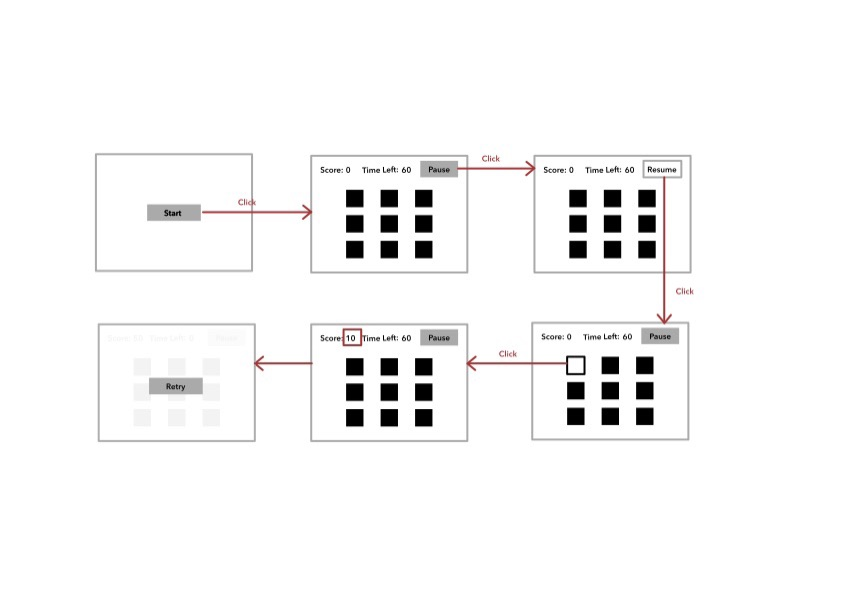

# Build a Basic Whac-a-mole Game with Vanilla JS

## Requirements

For this basic version, our game should meet the following requirements:

- User can start/pause/resume/retry a game
- 3 x 3 hole/mole grid
- User has 60 seconds to play
- User scores 10 points every time he/she hits a mole

## User Flow

